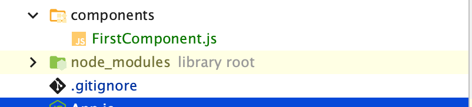

# 1_komponenter_vejledning
### Components, props, states og assets

#### slut resultat


# Component
Læs mere om komponenter på https://reactjs.org/docs/components-and-props.html

1. Lav et nyt expo projekt i din projekt mappe med `expo init 1_komponenter`og åben projektet i webstorm


2. Opret en mappe i dit nyoprettet projekt ved navn components 


3.	Lav en ny komponent kaldt First component, og brug templaten nederst i guiden. Tilføj nu et `<Text></Text>` element i return  
    


4.	Importer din komponent i App.js og implementer den i App.js’ return funktion. (Husk at return() kun kan returnere ét element)
    `import FirstComponent from "./components/FirstComponent";`
      

5.	Kør appen og se om den viser teksten ( hvis den ikke viser teksten, læs hvad react native giver og fejl og fiks)

      
6.	Lav nu en komponent kaldt PropsComponent og brug komponent templaten. I templaten skriv nu `const {name} = props ` over return funktionen. Og lav nu et `<Text></Text>` element som har proppen name i sig med `{name}`, og importer ligesom FirstComponent i App.js.


7.	I App.js send nu dit navn værdi via en prop kald name ´<PropComponent name={''}/>´


8.	Kør appen og se om den viser teksten, som du har angivet i App.js.


9.	Opret flere instanser af din komponent i App.js’ render() metode og send forskellige tekster til hver af dem,
      

10.	Opret nu et ny komponent kaldt ´ButtonComponent´ og deri lav en ny instans af active over return funktionen med useState() funktionen med en default value false:  `const [active, setActive] = useState(false)`


10. b) 	Opret nu et `Text` element hvor du har en conditional render funktion med en tilhørende knap som kan ændre på active Staten
    1. læs mere https://reactjs.org/docs/conditional-rendering.html#inline-if-else-with-conditional-operator ( se bort fra this.state)

    
11.	En Button skal altid have en title og en onPress prop. Til onPress vil vi ændre status på active med setActive: `onPress={()=> setActive(!active)}`  funktionen.
    1. Prøv at se om du kan forklare hvad der sker i onpress funktionen 

12.	Importer nu `ButtonComponent` ind i App.js, og test din nye knap


13.	Opret nu et ny komponent kaldt ´InputComponent´ og deri lav en ny instans af inputValue over return funktionen med useState() funktionen med en tom string default værdi "";


14.	I din `<View></View>` lav et TextInput felt med et `style prop, onChangeText og value`. Udfyld onChange med setInputeValue funktionen. I value sæt lig med inputValue fx: `value={inputValue}`
    Læs mere https://reactnative.dev/docs/textinput 
       

15. Importer nu `InputComponent` ind i App.js, og test dit nye input felt


16. Opret en ny komponent kaldt`AssetComponent` i Components, og gør klar til at du skal bruge en prop kaldt url ( ligesom i PropsComponent )


17. I `<View></View>` hent et Image element og i source propen sæt AssetComponents prop url som værdi. Læs mere https://reactnative.dev/docs/image


16. Import øverst i App.js et billede fra assets mappen: `import FirstImage from "./assets/favicon.png"` , og derefter importer AssetComponent og placer den i return funktionen med proppen url

17. giv nu `AssetComponent` FirstImage som url værdien --> `<AssetComponent url={FirstImage}/> `
    (Vigtigt: giv width og height til Image)
    
18. Overfør til sidst dit eget billede til projekt mappen og få det vist i din app


**Ekstra:** Til sidst lav nu en multi funktions komponent hvor du anvender input, output og en knap f.eks. til at brugeren indtaster en tekst som konfirmeres eller noget helt andet
 

       
#### Tips
- Brug console.log(værdi) til når du debugger
- Læs i appen hvad react native brokker sig over 
- Læs docsen inde på https://reactnative.dev/docs/getting-started 

#### Komponent template

```
import React from 'react';
import { StyleSheet, View} from 'react-native';

{/*HUSK AT SKIFTE NAVN*/}
const FirstComponent = (props) => {

    return (
            <View style={styles.container}>
               {/*alt vores content*/}
            </View>
    );
}

{/*HUSK AT SKIFTE NAVN*/}
export default FirstComponent;

const styles = StyleSheet.create({
    container: {
        flex: 1,
        backgroundColor: '#fff',
        alignItems: 'center',
        justifyContent: 'center',
    },
});
`


